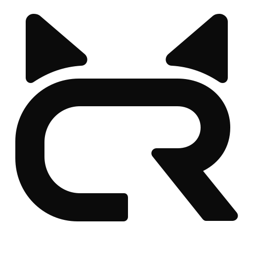

# CatRobotics Viewer

[](https://github.com/catrobtics/viewer/actions/workflows/ci.yml)
[](https://www.npmjs.com/package/@catrobtics/viewer)
[](LICENSE)

[English](#english) · [中文](#中文)

<p align="center">
  
</p>

## English

CatRobotics Viewer is a browser workspace for inspecting, visualizing, and diagnosing robotics data. It is available as a hosted application and as the complete embeddable npm package [`@catrobtics/viewer`](https://www.npmjs.com/package/@catrobtics/viewer).

### Highlights

- Open local MCAP, ROS 1 bag, ROS 2 `.db3`, and ULog files.
- Connect to live robots through rosbridge or the Foxglove WebSocket protocol.
- Combine synchronized 3D, image, plot, log, map, table, diagnostics, raw-message, and topic views.
- Save reusable layouts, variables, parameters, subscriptions, and panel settings.
- Embed the complete Viewer through React `<Viewer />` or framework-neutral React DOM `mountViewer(element)`.
- Apply product branding, app-bar content, and light/dark theme tokens without forking the Viewer.

### Use online or locally

Open [catrobtics.com](https://catrobtics.com), or run the repository locally with Node.js 22.12+ (Node.js 24 recommended), pnpm 10.34.5, and Git LFS:

```sh
git clone https://github.com/catrobtics/viewer.git
cd viewer
git lfs pull
corepack enable
pnpm install --frozen-lockfile
pnpm dev
```

Build the web application and run repository checks:

```sh
pnpm web:build:prod
pnpm lint:ci
pnpm typecheck
pnpm test
pnpm viewer:build
pnpm viewer:pack:check
```

### Embed with React

```sh
pnpm add @catrobtics/viewer react react-dom
```

```tsx
import { Viewer } from '@catrobtics/viewer'
import '@catrobtics/viewer/style.css'

export function App() {
  return (
    <div style={{ height: '100vh', minHeight: 0 }}>
      <Viewer branding={{ productName: 'My Robotics Viewer' }} />
    </div>
  )
}
```

The container must have an explicit height. Embedded defaults do not change the host URL, document title, context menu, global CSS, or global `fetch`.

### Embed with React DOM

```ts
import { mountViewer } from '@catrobtics/viewer'
import '@catrobtics/viewer/style.css'

const mounted = mountViewer(document.getElementById('viewer')!, {
  branding: { productName: 'Robot Operations' },
})

// Later:
mounted.render({ branding: { productName: 'Robot Operations' } })
mounted.unmount()
```

Read the [npm package guide](packages/viewer/README.md) for full-page mode, branding, lifecycle, props, browser compatibility, and host-page isolation. A runnable minimal Vite application is available in [`examples/react-viewer`](examples/react-viewer/README.md).

### Repository layout

| Path | Purpose |
| --- | --- |
| `examples/react-viewer/` | Minimal Vite + React application consuming the published npm package |
| `packages/viewer/` | Public `@catrobtics/viewer` React and React DOM package |
| `packages/studio-base/` | Viewer UI, built-in panels, players, and application services |
| `packages/studio-web/` | Browser composition, data sources, and public assets |
| `web/` | Hosted web application consuming the Viewer public API |
| `benchmark/` | Browser performance scenarios |
| `ci/` | Package validation and release helpers |

Read [CONTRIBUTING.md](CONTRIBUTING.md) before contributing. Maintainers should follow the [Viewer npm release guide](docs/viewer-package-release.md).

### License and origins

This repository is licensed under the [Mozilla Public License 2.0](LICENSE). CatRobotics Viewer is derived from Foxglove Studio; its lineage includes Webviz, originally developed at Cruise. Copyright and source attribution remain in [NOTICE](NOTICE).

## 中文

CatRobotics Viewer 是一个用于查看、可视化和诊断机器人数据的浏览器工作台。除了在线应用，它也以完整可嵌入 npm 包 [`@catrobtics/viewer`](https://www.npmjs.com/package/@catrobtics/viewer) 提供，不只是扩展类型定义。

### 主要能力

- 打开本地 MCAP、ROS 1 bag、ROS 2 `.db3` 和 ULog 文件。
- 通过 rosbridge 或 Foxglove WebSocket 协议连接实时机器人。
- 同步组合 3D、图像、曲线、日志、地图、表格、诊断、原始消息和话题视图。
- 保存布局、变量、参数、订阅和面板配置，复用调试工作流。
- 通过 React `<Viewer />` 或通用 React DOM `mountViewer(element)` 接入完整 Viewer。
- 自定义产品名称、Logo、App Bar 内容与亮色/暗色主题。

### 在线与本地运行

可直接访问 [catrobtics.com](https://catrobtics.com)。本地开发需要 Node.js 22.12+（推荐 Node.js 24）、pnpm 10.34.5 和 Git LFS：

```sh
git clone https://github.com/catrobtics/viewer.git
cd viewer
git lfs pull
corepack enable
pnpm install --frozen-lockfile
pnpm dev
```

常用构建和检查命令：

```sh
pnpm web:build:prod
pnpm lint:ci
pnpm typecheck
pnpm test
pnpm viewer:build
pnpm viewer:pack:check
```

### React 接入

```sh
pnpm add @catrobtics/viewer react react-dom
```

```tsx
import { Viewer } from '@catrobtics/viewer'
import '@catrobtics/viewer/style.css'

export function App() {
  return (
    <div style={{ height: '100vh', minHeight: 0 }}>
      <Viewer branding={{ productName: '机器人数据中心' }} />
    </div>
  )
}
```

父容器必须有明确高度。默认嵌入模式不会修改宿主 URL、网页标题、右键菜单、全局 CSS 或全局 `fetch`。

### React DOM 接入

```ts
import { mountViewer } from '@catrobtics/viewer'
import '@catrobtics/viewer/style.css'

const mounted = mountViewer(document.getElementById('viewer')!, {
  branding: { productName: '机器人运维中心' },
})

mounted.render({ branding: { productName: '机器人运维中心' } })
mounted.unmount()
```

完整页面模式、品牌配置、生命周期、全部 props、浏览器兼容性和宿主隔离说明见 [npm 包接入文档](packages/viewer/README.md)。可直接运行的最小 Vite 示例位于 [`examples/react-viewer`](examples/react-viewer/README.md)。

### 仓库结构

| 路径 | 用途 |
| --- | --- |
| `examples/react-viewer/` | 使用已发布 npm 包的最小 Vite + React 应用 |
| `packages/viewer/` | 对外发布的 `@catrobtics/viewer` React/React DOM 包 |
| `packages/studio-base/` | Viewer UI、内置面板、播放器与应用服务 |
| `packages/studio-web/` | Web 端组装、数据源和公共资源 |
| `web/` | 通过公开 Viewer API 运行的在线应用入口 |
| `benchmark/` | 浏览器性能测试场景 |
| `ci/` | npm 包校验与发布辅助脚本 |

参与开发前请阅读 [CONTRIBUTING.md](CONTRIBUTING.md)。维护者发布 npm 包时，请遵循 [Viewer npm 发布指南](docs/viewer-package-release.md)。

### 许可证与项目来源

本仓库采用 [Mozilla Public License 2.0](LICENSE)。CatRobotics Viewer 基于 Foxglove Studio 演进，其技术来源包含最初由 Cruise 开发的 Webviz。版权与来源说明保留在 [NOTICE](NOTICE) 中。
